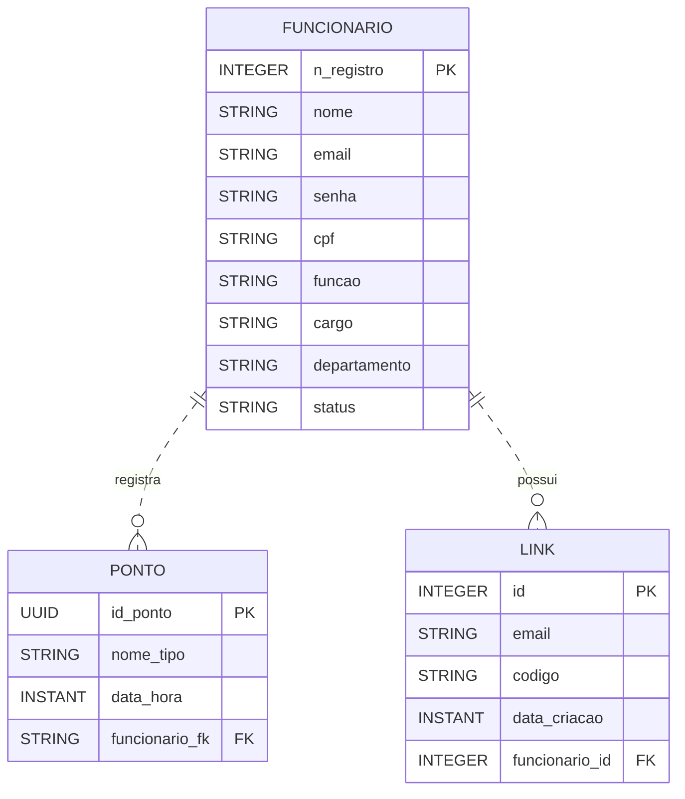

# API da Plataforma [Bunchin](https://github.com/MarcosAlves90/bunchin)


## Descrição

O **bunchin-api-java** é uma API REST desenvolvida em Java com Spring Boot, voltada para o gerenciamento de funcionários e controle de pontos em ambientes corporativos. A plataforma oferece funcionalidades completas para cadastro, autenticação e administração de usuários, registro de pontos, além de recursos de recuperação e redefinição de senha. O sistema foi projetado para ser seguro, escalável e de fácil integração com outros sistemas, utilizando práticas modernas como cache para otimização de consultas e integração com banco de dados PostgreSQL. Ideal para empresas que buscam automatizar e centralizar o controle de presença e acesso de colaboradores.

## Funcionalidades Principais

- **CRUD de Funcionários:** Cadastro, consulta, atualização e remoção de funcionários.
- **Login:** Autenticação de usuários por e-mail ou CPF e senha.
- **Gerenciamento de Pontos:** Registro e controle de pontos dos funcionários.
- **Recuperação e Redefinição de Senha:** Geração de links de redefinição, verificação de códigos e alteração de senha.
- **Cache de Funcionários:** Otimização de consultas utilizando cache.

## Tecnologias Utilizadas


- Spring Data JPA
- Spring Security
- PostgreSQL
- Maven

## Pré-requisitos

- Docker
- Docker Compose (opcional)

## Instalação e Execução

1. Clone o repositório:

   ```bash
   git clone https://github.com/MarcosAlves90/bunchin-api-java.git
   ```

2. Configure as variáveis de ambiente necessárias em um arquivo `.env` (opcional) ou edite o `application.properties` conforme necessário.

3. Para construir e rodar a aplicação, utilize o Docker:

   ```bash
   docker build -t bunchin-api .
   docker run -p 8080:8080 --env-file .env bunchin-api
   ```

   > Certifique-se de que o banco de dados PostgreSQL esteja acessível e configurado conforme as variáveis de ambiente.

## Endpoints Principais

### Funcionários

- `GET /api/funcionario` — Lista todos os funcionários
- `GET /api/funcionario/{cpf}` — Busca funcionário por CPF
- `POST /api/funcionario` — Cria um novo funcionário
- `PUT /api/funcionario/{cpf}` — Atualiza um funcionário
- `DELETE /api/funcionario/{cpf}` — Remove um funcionário

### Login

- `POST /api/login` — Realiza login com e-mail ou CPF e senha

### Pontos

- `GET /api/ponto` — Lista todos os pontos
- `POST /api/ponto` — Cria um novo ponto

### Recuperação de Senha

- `POST /api/storeResetCode` — Armazena código de redefinição
- `POST /api/checkEmailExists` — Verifica se o e-mail existe
- `POST /api/verifyResetCode` — Verifica validade do código
- `PUT /api/resetPassword` — Redefine a senha
- `PUT /api/newPassword` — Define nova senha

## Exemplo de Requisição de Login

```json
POST /api/login
{
  "email": "usuario@dominio.com",
  "senha": "senha123"
}
```

## Estrutura do Projeto

- `src/main/java/br/com/fatecmaua/bunchin/control` — Controllers REST
- `src/main/java/br/com/fatecmaua/bunchin/model` — Entidades JPA
- `src/main/java/br/com/fatecmaua/bunchin/repository` — Repositórios JPA
- `src/main/java/br/com/fatecmaua/bunchin/service` — Serviços e cache
- `src/main/resources` — Configurações e recursos estáticos



## Testes

Para rodar os testes automatizados:

```bash
docker run bunchin-api mvn test
```

## Docker

O projeto já possui um `Dockerfile` configurado para construção e execução da aplicação. Utilize o comando abaixo para construir e rodar:

```bash
docker build -t bunchin-api .
docker run -p 8080:8080 --env-file .env bunchin-api
```

## Contribuição

Pull requests são bem-vindos! Para grandes mudanças, abra uma issue primeiro para discutir o que você gostaria de modificar.

## Licença

Este projeto está sob a licença MIT.
